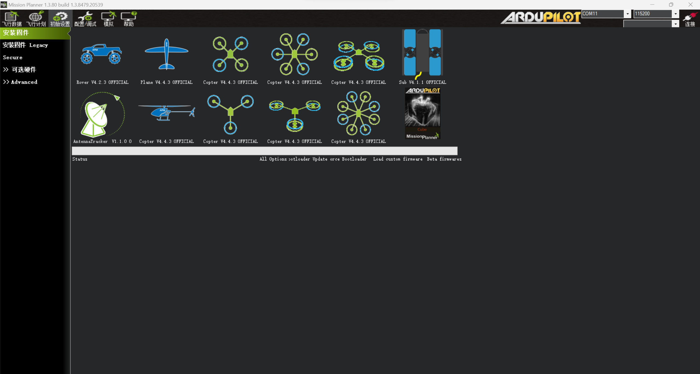
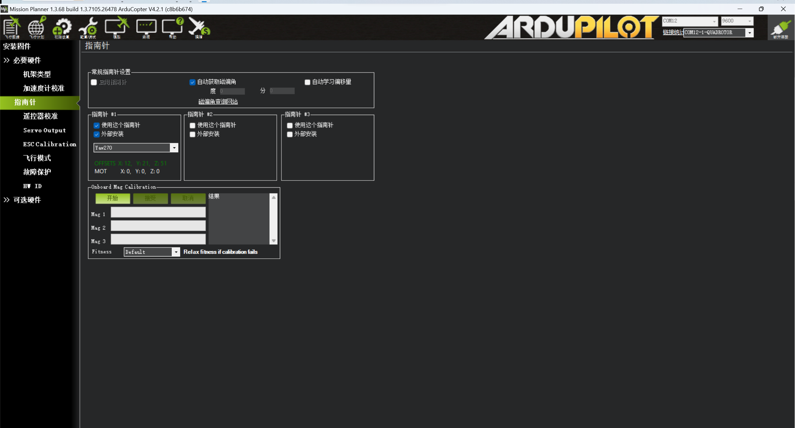
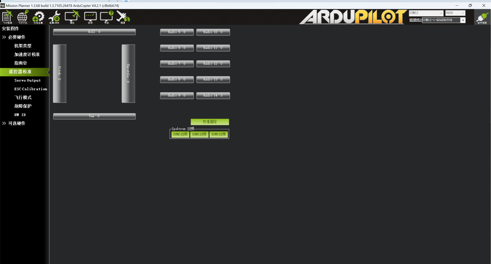
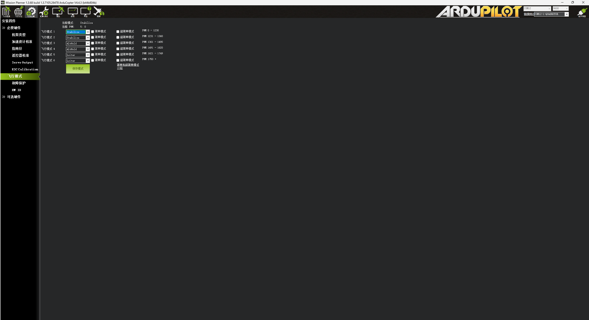

# 无人机组装
无人机的机架组装按照购买商家的指引即可。

## 焊接tips
首次安装无人机可能会面临焊接的难题，电机连接电极板，电机连接电调都需要焊接。在焊接前将电烙铁升温至约400℃。首先给电烙铁头和线头，电极板都预上一点锡，而后将电线靠近电机板，焊锡丝置于两者中间用电烙铁加热，焊锡丝不断向前送直至焊点的锡圆润饱满，彻底包裹住线头。

# 飞控调试
本文采用pix飞控，Mission Planner（MP）地面站软件。将飞控用数据线与电脑连接，可在**设备管理器**查看连接飞控的端口号，如果显示有未识别的设备可以重新安装MP以安装驱动。在MP右上角选择对应的端口号和波特率（一般默认115200），点击连接。

## 安装固件
首先对飞控烧录固件，在初始设置-安装固件选择对应机型的固件，点击安装，进度条可现实安装进度。

## 加速度计校准
在初始设置-必要硬件-加速度计校准中点击校正，按照文字提示摆放飞机，校准成功后会显示"calibration successful"，如果不成功则重新进行校准。

## 指南针校准
在指南针校准中点击校准，而后将飞机自由旋转，尽量覆盖可能多的角度，直至下方进度条变满，此时会显示"reboot ......"，此时断开飞控连接，，断开数据线，再重新连接飞控，回到该界面即可显示校准指南针的offset，如果为绿色则offset值在可接受范围内。

## 遥控器校准
首先需要将遥控器与飞控连接。打开遥控器，长按飞控接收机侧面的对码键，灯光闪烁进入对频模式，将遥控器放置在接收器附近。对频完成后灯光常亮，遥控器信号图案满格。

对码完成后即可在MP中看到遥控器对应的按钮和摇杆输出，点击校准，将摇杆分别推到上下左右的边界，遥控器每个按钮都在不同状态之间切换一遍后点击完成即可校准。

## 飞行模式选择
在飞行模型选择界面中，切换遥控器上的飞行模式三段式切换开关（对应开关可以自行在遥控器设置），切换开关可以看到每段对应的是第几飞行模式，而后在MP中进行设置即可，新飞机建议设置为增稳（Stablizie），定高（AltHold），悬停（Loiter）这3个模式。对应模式的详细介绍可以参考链接<https://doc.cuav.net/tutorial/copter/flight-modes.html>

## 电调校准
**！！请勿安装螺旋桨！！**

**！！请勿安装螺旋桨！！**

**！！请勿安装螺旋桨！！**
1. 遥控器油门推至最大

2. 电调通电（灯光3色同时闪烁）

3. 电调断电（遥控器不动）

4. 电调通电，打开安全开关

5. 遥控器油门调至最低

6. 电机长响，完成校准

## 电机旋转方向检查
不同机型的电机编号和旋转方向不同，可参考链接<https://doc.cuav.net/tutorial/copter/first-setup/assermbly/connect-escs-and-motors.html>进行自检。若电机旋转方向错误可以交换电机3根电线中的任意2根（这是通用方式，某些电调支持通过修改参数的方式修改电机旋转方向）

# 第一次试飞

## 安装螺旋桨
螺旋桨安装参考商家安装视频，请仔细检查螺旋桨与电机对应是否正确。螺旋桨迎风面（桨叶较高的一侧）在左侧的安装至逆时针旋转的电机，反之安装到顺时针旋转的电机。桨叶上侧的曲线为后略下降的平滑曲线，注意不要将螺旋桨安装反。

## 原地怠速测试
将飞机解锁（遥控器Yaw推到右侧），电机怠速旋转，感受是否有向上吹的风，若有则螺旋桨安装有误。

## 试飞
试飞请**人员保持安全距离**，拍摄视频记录。

